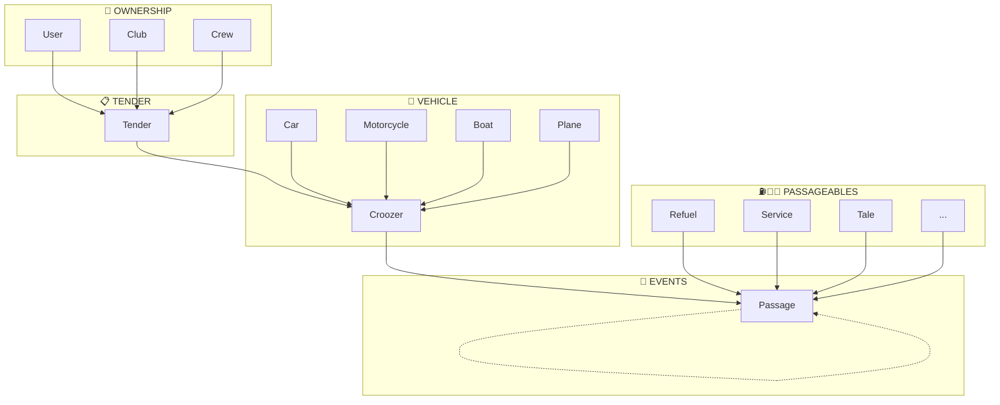
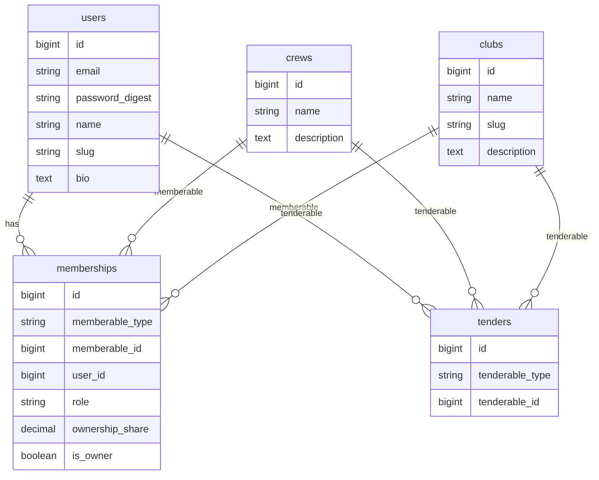
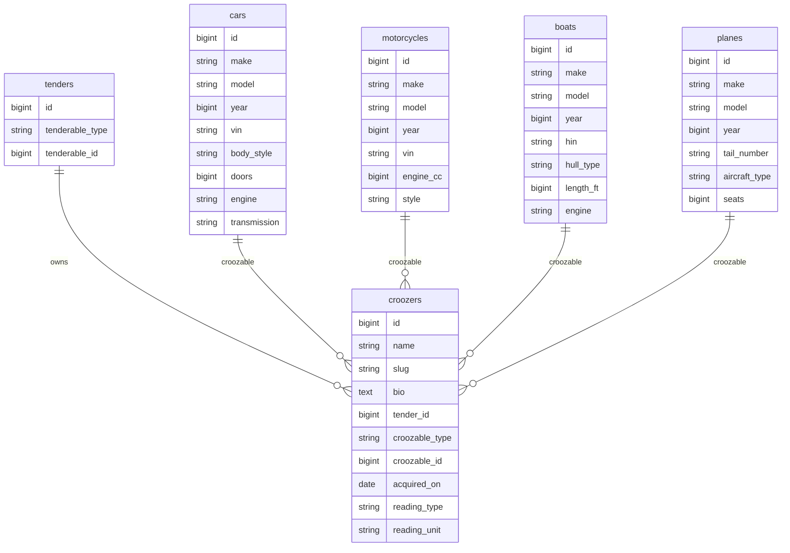
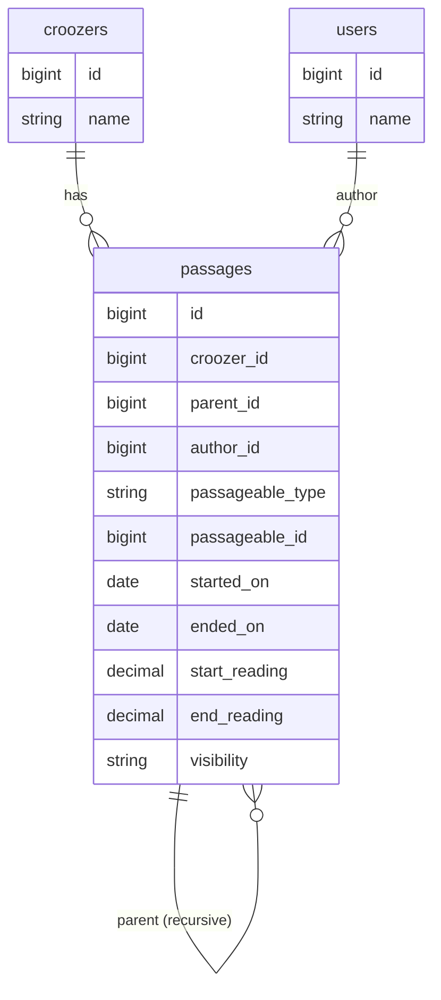
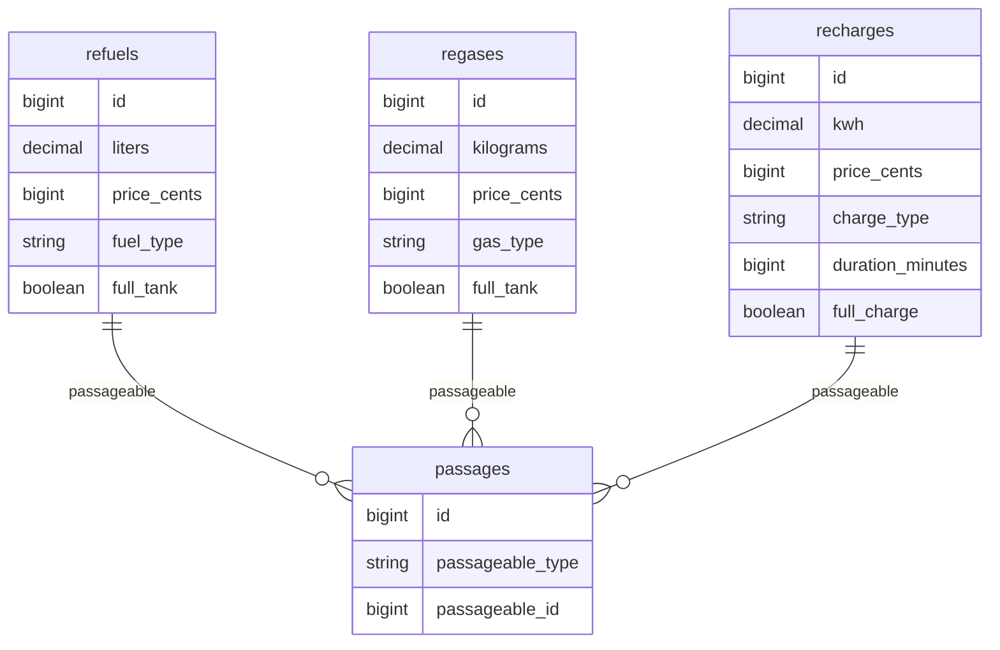
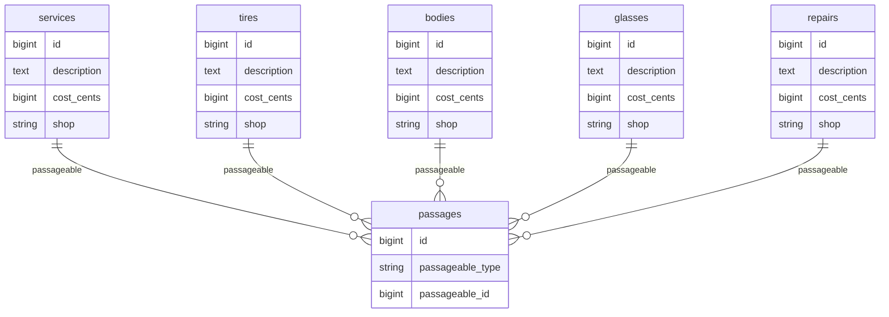
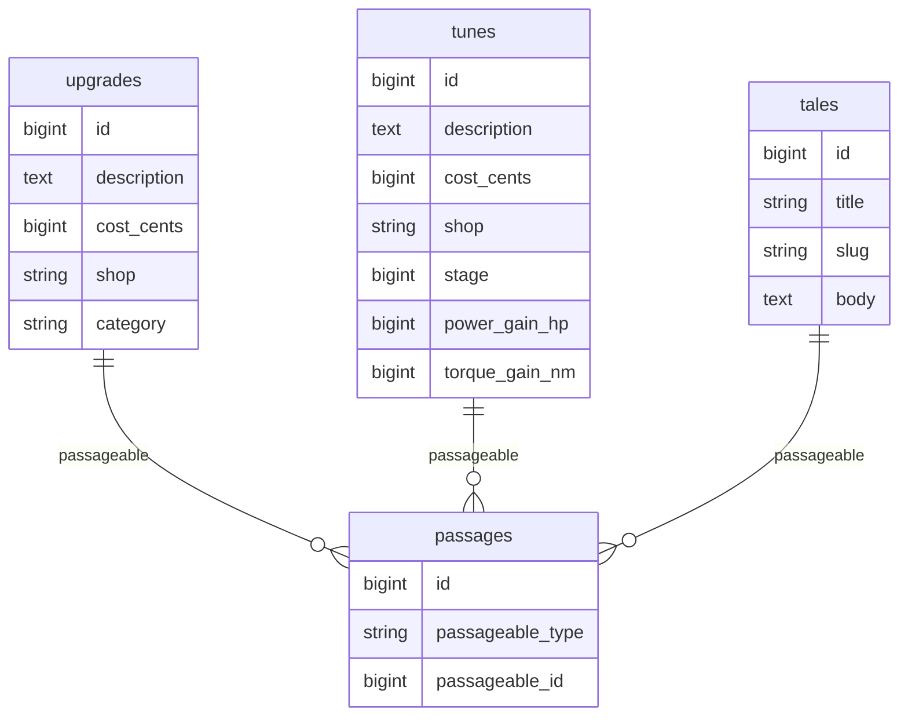

# Crooz Database Schema

## Design Decisions

### Delegated Type Pattern (à la 37signals)

Inspired by Basecamp's Recording/Recordable pattern. **Three core delegated types:**

| Delegator | Delegated to | Purpose |
|-----------|--------------|---------|
| **Tender** | User, Club, Crew | Ownership model (who/how) |
| **Croozer** | Car, Motorcycle, Boat, Plane... | Vehicle type (what) |
| **Passage** | Refuel, Service, Tale... | Event type (when/what happened) |

Benefits:
- Adding new types = just a new table, no schema changes on the delegator
- Unified queries across types
- Tree structure on passages → children (comments on a refuel, etc.)
- Tender encapsulates pricing/access logic per ownership model

### Vocabulary

**"Passage"** — a moment in the life of a croozer:
- Has an entry and exit (start/end reading, dates)
- Has duration (time spent)
- Contains what happened (the passageable)
- Also means "excerpt" (passage from a book) → fits with Tales

Like a mountain pass 🏔️ — you enter, traverse, and exit.

### Tender (Ownership Model) — `delegated_type :tenderable`

**Tender** = who/how a croozer is owned. Determines pricing and access model.

| Tender | Pricing | Access | Use case |
|--------|---------|--------|----------|
| **User** | Free | Solo | My personal car |
| **Club** | Free | Open (membership) | Non-profit car club, association |
| **Crew** | Paid 💰 | Closed (invite-only) | Co-ownership, private stable |

**Club** = open to all, join via membership (public adhésion)
**Crew** = private, invite-only

**Crew features (premium):**
- Ownership shares (50/50, 70/30...)
- Roles per member (mechanic, driver, detailer...)
- Invite non-owners (mechanic friend, buddies)
- Collaborative management

The croozer doesn't know who owns it directly — it only knows its tender. Ownership details (shares, roles) live inside the tender.

### Generic Readings

Crooz supports multiple vehicle types:
- 🚗 Cars → odometer (km/miles)
- 🛩️ Planes → hobbs/tach (hours)
- ⛵ Boats → engine hours

Solution: generic `start_reading` / `end_reading` on passages, with `reading_type` and `reading_unit` on the croozer.

---

## Schema Overview



---

## Detailed Schemas

### 1. Ownership Layer



### 2. Vehicle Layer



### 3. Events Layer (Passages)



### 4. Passageables (Energy)



### 5. Passageables (Maintenance)



### 6. Passageables (Upgrades & Stories)



---

## Key Patterns

### Tender (delegated_type)

```ruby
class Tender < ApplicationRecord
  belongs_to :croozer
  
  delegated_type :tenderable, types: %w[User Club Crew]
  
  # Pricing logic per type
  def free? = tenderable.is_a?(User) || tenderable.is_a?(Club)
  def paid? = tenderable.is_a?(Crew)
end
```

### Croozer (delegated_type)

```ruby
class Croozer < ApplicationRecord
  belongs_to :tender
  has_many :passages
  
  delegated_type :croozable, types: %w[Car Motorcycle Boat Plane]
  
  # Reading config per vehicle type
  attribute :reading_type  # "odometer", "engine", "hobbs"
  attribute :reading_unit  # "km", "miles", "hours"
end
```

### Passage (delegated_type)

```ruby
class Passage < ApplicationRecord
  belongs_to :croozer
  belongs_to :author, class_name: "User"
  belongs_to :parent, class_name: "Passage", optional: true
  has_many :children, class_name: "Passage", foreign_key: :parent_id
  
  delegated_type :passageable, types: %w[
    Refuel Regas Recharge Service Tire Body Glass
    Repair Upgrade Tune Tale
  ]
  
  # Generic readings with helpers
  def start_odometer_km
    start_reading if croozer.reading_type == "odometer" && croozer.reading_unit == "km"
  end
  
  def reading_delta
    end_reading - start_reading if end_reading && start_reading
  end
end
```

### Passageable Concern (recommended pattern)

Following 37signals approach: **no `passage_types` table**, metadata lives in code.

```ruby
# app/models/concerns/passageable.rb
module Passageable
  extend ActiveSupport::Concern
  
  included do
    has_one :passage, as: :passageable, touch: true
    
    class_attribute :passage_category
    class_attribute :passage_icon
  end
  
  class_methods do
    def category(name)
      self.passage_category = name
    end
    
    def icon(emoji)
      self.passage_icon = emoji
    end
    
    # All passageable classes in a category
    def in_category(cat)
      Passageable.types.select { |t| t.constantize.passage_category == cat }
    end
  end
  
  # Registry of all passageable types
  TYPES = %w[Refuel Regas Recharge Service Tire Body Glass Repair Upgrade Tune Tale].freeze
  
  def self.types = TYPES
  
  # Capabilities (override in concrete types)
  def commentable? = false
  def exportable? = true
  def copyable? = true
end

# app/models/passageables/refuel.rb
class Refuel < ApplicationRecord
  include Passageable
  
  category :energy
  icon "⛽"
end

# app/models/passageables/service.rb
class Service < ApplicationRecord
  include Passageable
  
  category :maintenance
  icon "🔧"
end
```

### Querying by category

```ruby
# app/models/passage.rb
class Passage < ApplicationRecord
  # Scope to filter by category
  scope :in_category, ->(cat) {
    types = Passageable.in_category(cat)
    where(passageable_type: types)
  }
end

# Usage
croozer.passages.in_category(:energy)      # All refuels, regases, recharges
croozer.passages.in_category(:maintenance) # All services, tires, repairs...

# Direct type query (Rails delegated_type provides this)
croozer.passages.refuels    # Only Refuel passages
croozer.passages.services   # Only Service passages
```

---

## Reference Tables

### Reading Types

| Type | Unit | Vehicle |
|------|------|---------|
| odometer | km | 🚗 Car (Europe) |
| odometer | miles | 🚗 Car (US/UK) |
| hobbs | hours | 🛩️ Plane |
| engine | hours | ⛵ Boat |

### Passageable Types

| Category | Types |
|----------|-------|
| Energy | refuels, regases, recharges |
| Maintenance | services, tires, bodies, glasses, repairs |
| Improvements | upgrades, tunes |
| Stories | tales |

### Tender Types

| Type | Pricing | Access |
|------|---------|--------|
| User | Free | Solo |
| Club | Free | Open (membership) |
| Crew | Paid | Closed (invite-only) |
