# Crooz Database Schema

## Design Decisions

### Delegated Type Pattern (à la 37signals)

Inspired by Basecamp's Recording/Recordable pattern:

- **Passage** = lightweight envelope (metadata, relationships, timestamps)
- **Passageable** = rich content (specific data and behavior per type)

Benefits:
- Single `passages` table for all events → unified timeline queries
- Adding new types = just a new table, no schema changes on `passages`
- Recordables are immutable → full history, easy versioning
- Tree structure → passages can have children (comments on a refuel, etc.)

### Vocabulary

**"Passage"** — a moment in the life of a croozer:
- Has an entry and exit (start/end reading, dates)
- Has duration (time spent)
- Contains what happened (the passageable)

Like a mountain pass 🏔️ — you enter, traverse, and exit.

### Tender (Ownership Model)

**Tender** = who/how a croozer is owned. Determines pricing and access model.

| Tender | Pricing | Access | Use case |
|--------|---------|--------|----------|
| **User** | Free | Solo | My personal car |
| **Club** | Free | Open (membership) | Non-profit car club, association |
| **Crew** | Paid 💰 | Closed (invite-only) | Co-ownership, private stable |

**Club** = open to all, join via membership (public adhésion)
**Crew** = private, invite-only

**Crew features (premium):**
- Ownership shares (50/50, 70/30...)
- Roles per member (mechanic, driver, detailer...)
- Invite non-owners (mechanic friend, buddies)
- Collaborative management

The croozer doesn't know who owns it directly — it only knows its tender. Ownership details (shares, roles) live inside the tender.

### Generic Readings

Crooz supports multiple vehicle types:
- 🚗 Cars → odometer (km/miles)
- 🛩️ Planes → hobbs/tach (hours)
- ⛵ Boats → engine hours

Solution: generic `start_reading` / `end_reading` on passages, with `reading_type` and `reading_unit` on the croozer.

---

```mermaid
erDiagram
    %% Core entities
    users {
        serial id PK
        varchar email
        varchar password_digest
        varchar name
        varchar slug
        text bio
    }

    crews {
        serial id PK
        varchar name
    }

    clubs {
        serial id PK
        varchar name
        varchar slug
        text description
    }

    %% Membership (polymorphic → crews, clubs)
    memberships {
        serial id PK
        varchar memberable_type
        integer memberable_id FK
        integer user_id FK
        varchar role
    }

    %% Tender (polymorphic → users, crews, clubs)
    tenders {
        serial id PK
        varchar tenderable_type
        integer tenderable_id FK
    }

    %% Croozer (delegated_type → cars, motorcycles, boats, planes...)
    croozers {
        serial id PK
        varchar name
        varchar slug
        text bio
        integer tender_id FK
        varchar croozable_type
        integer croozable_id FK
        date acquired_on
        varchar reading_type
        varchar reading_unit
    }

    %% Vehicles (croozables)
    cars {
        serial id PK
        varchar make
        varchar model
        integer year
        varchar vin
        varchar body_style
        integer doors
        varchar engine
        varchar transmission
    }

    motorcycles {
        serial id PK
        varchar make
        varchar model
        integer year
        varchar vin
        integer engine_cc
        varchar style
    }

    %% Passage (delegated_type → passageables, recursive parent)
    passages {
        serial id PK
        integer croozer_id FK
        integer parent_id FK
        integer author_id FK
        varchar passageable_type
        integer passageable_id FK
        date started_on
        date ended_on
        decimal start_reading
        decimal end_reading
        varchar visibility
    }

    %% Energy passageables
    refuels {
        serial id PK
        decimal liters
        integer price_cents
        varchar fuel_type
        boolean full_tank
    }

    regases {
        serial id PK
        decimal kilograms
        integer price_cents
        varchar gas_type
        boolean full_tank
    }

    recharges {
        serial id PK
        decimal kwh
        integer price_cents
        varchar charge_type
        integer duration_minutes
        boolean full_charge
    }

    %% Maintenance passageables
    services {
        serial id PK
        text description
        integer cost_cents
        varchar shop
    }

    tires {
        serial id PK
        text description
        integer cost_cents
        varchar shop
    }

    bodies {
        serial id PK
        text description
        integer cost_cents
        varchar shop
    }

    glasses {
        serial id PK
        text description
        integer cost_cents
        varchar shop
    }

    repairs {
        serial id PK
        text description
        integer cost_cents
        varchar shop
    }

    %% Upgrades & Stories passageables
    upgrades {
        serial id PK
        text description
        integer cost_cents
        varchar shop
        varchar category
    }

    tunes {
        serial id PK
        text description
        integer cost_cents
        varchar shop
        integer stage
        integer power_gain_hp
        integer torque_gain_nm
    }

    tales {
        serial id PK
        varchar title
        varchar slug
        text body
    }

    %% Relations
    users ||--o{ memberships : "has"
    crews ||--o{ memberships : "memberable"
    clubs ||--o{ memberships : "memberable"

    users ||--o{ tenders : "tenderable"
    crews ||--o{ tenders : "tenderable"
    clubs ||--o{ tenders : "tenderable"

    tenders ||--o{ croozers : "owns"
    cars ||--o{ croozers : "croozable"
    motorcycles ||--o{ croozers : "croozable"

    croozers ||--o{ passages : "has"
    users ||--o{ passages : "author"
    passages ||--o{ passages : "parent"

    refuels ||--o{ passages : "passageable"
    regases ||--o{ passages : "passageable"
    recharges ||--o{ passages : "passageable"
    services ||--o{ passages : "passageable"
    tires ||--o{ passages : "passageable"
    bodies ||--o{ passages : "passageable"
    glasses ||--o{ passages : "passageable"
    repairs ||--o{ passages : "passageable"
    upgrades ||--o{ passages : "passageable"
    tunes ||--o{ passages : "passageable"
    tales ||--o{ passages : "passageable"
```



## Key Patterns

### Passage (Recording equivalent)

```ruby
class Passage < ApplicationRecord
  belongs_to :croozer
  belongs_to :author, class_name: "User"
  belongs_to :parent, class_name: "Passage", optional: true
  has_many :children, class_name: "Passage", foreign_key: :parent_id
  
  delegated_type :passageable, types: %w[
    Refuel Regas Recharge Service Tire Body Glass
    Repair Upgrade Tune Tale
  ]
  
  # Generic readings with helpers
  def start_odometer_km
    start_reading if croozer.reading_type == "odometer" && croozer.reading_unit == "km"
  end
  
  def reading_delta
    end_reading - start_reading if end_reading && start_reading
  end
end
```

### Passageable Concern

```ruby
module Passageable
  extend ActiveSupport::Concern
  
  included do
    has_one :passage, as: :passageable, touch: true
  end
  
  # Capabilities (override in concrete types)
  def commentable? = false
  def exportable? = true
  def copyable? = true
end
```

### Reading Types

| Type | Unit | Example |
|------|------|---------|
| odometer | km | 🚗 Car (Europe) |
| odometer | miles | 🚗 Car (US/UK) |
| hobbs | hours | 🛩️ Plane |
| engine | hours | ⛵ Boat |

## Passageable Types

| Category | Types |
|----------|-------|
| Energy | refuels, regases, recharges |
| Maintenance | services, tires, bodies, glasses, repairs |
| Improvements | upgrades, tunes |
| Stories | tales |
